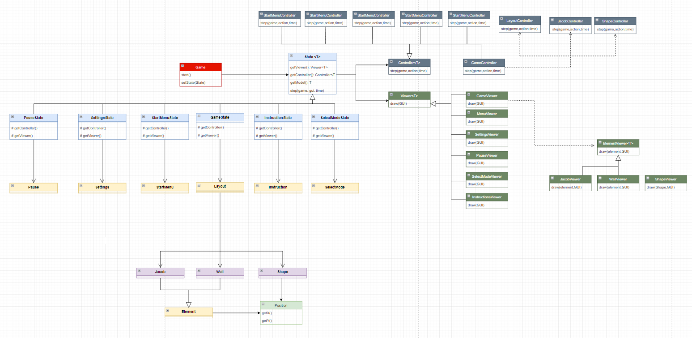
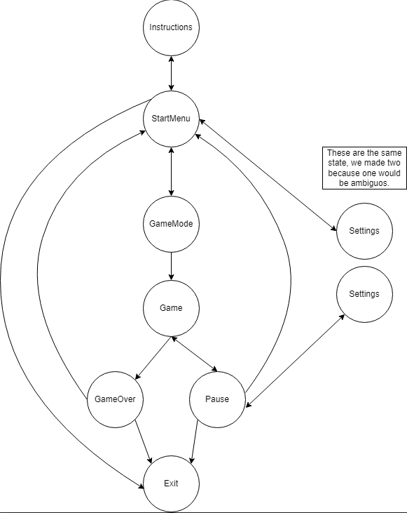
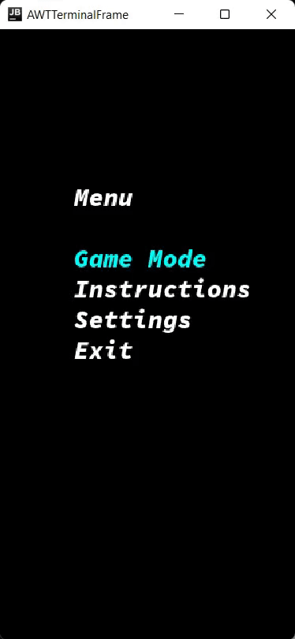
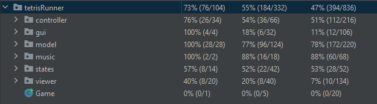

## LDTS_l05gr06 - TETRIS RUNNER

> Include here one or two paragraphs explaining the main idea of the project, followed by a sentence identifying who the authors are.

In this new exciting multiplayer version of a game we all are familiar with - tetris - there's a vast sea of fun ways to play it.
The game is basically the tetris everyone knows, but there's a little man down there, where the pieces fall, trying to avoid them. 

This makes it so there's a lot of options for the users - let's call the user controlling the pieces player1 and the other one
player2 - to choose:

- **"Classic"** - While player1 is playing normal tetris, player2 is just avoiding the falling pieces;
- **Co-op** - Player1 is trying to get player2 up top as fast as possible;
- **1v1** - Player1 is purposefully trying to make player2 loose.

This project was developed by *Francisco Campos* (*up202108735*@up.pt), *João Figueiredo* (*up202108829*@up.pt) and *João Longras* (*up202108780*@up.pt) for LDTS 2022⁄23.

### IMPLEMENTED FEATURES

> This section should contain a list of implemented features and their descriptions. In the end of the section, include two or three screenshots that illustrate the most important features.

**Menu**: Working menu with multiple options, such as 'Game Mode', to select the intended variant of the game and 'Instructions', to read the instructions of each
mode. We also implemented the tetris theme song running on the background, therefore there's an additional option 'Settings' in which you can mute and change the music's volume.

Although the pause menu isn't working totally by now, it's already possible to pause the game by pressing ESC. 

**Player2**:

- **Jumping** - The game character will jump when the arrow-up key is pressed.
- **Moving** - The player will move, sideways, when the user presses arrow-left or arrow-right.

### PLANNED FEATURES

> This section is similar to the previous one but should list the features that are not yet implemented. Instead of screenshots you should include GUI mock-ups for the planned features.

Currently, there's a block class implemented, which is 100% temporary and its purpose is to test player2's dynamics 
regarding the shapes. In the future, we will implement, instead, the shapes itself (you can get an idea of what we planned
observing the UML). Shape will be an abstract class with ShapeSquare, ShapeT, ShapeS, ShapeZ, ShapeL, ShapeJ and ShapeLine extending it.

As pause isn't yet returning to the game, we will need some form of saving the game state when pausing, we will do that with a specific pattern, more on that later.

We also need to implement Player1's inputs.

**Player1**:

- **Moving the shape** - The shape will move, sideways, when the user presses 'A' or 'D' (left or right, respectively).
- **Rotating the shape** - The shape will rotate, when the user presses 'W' or 'S' (clockwise or anti-clockwise, respectively).

We also need to create the GameOverState, which will differ from game mode to game mode. Each game mode, mechanically speaking, is exactly the same, therefore
the GameState is the same, but who wins and the leaderboards change according to the chosen mode. For this we will also need to implement a new pattern, maybe the same as the pause one.

### DESIGN

> This section should be organized in different subsections, each describing a different design problem that you had to solve during the project. Each subsection should be organized in four different parts:

- **Problem in Context.** The description of the design context and the concrete problem that motivated the instantiation of the pattern. Someone else other than the original developer should be able to read and understand all the motivations for the decisions made. When refering to the implementation before the pattern was applied, don’t forget to [link to the relevant lines of code](https://help.github.com/en/articles/creating-a-permanent-link-to-a-code-snippet) in the appropriate version.
- **The Pattern.** Identify the design pattern to be applied, why it was selected and how it is a good fit considering the existing design context and the problem at hand.
- **Implementation.** Show how the pattern roles, operations and associations were mapped to the concrete design classes. Illustrate it with a UML class diagram, and refer to the corresponding source code with links to the relevant lines (these should be [relative links](https://help.github.com/en/articles/about-readmes#relative-links-and-image-paths-in-readme-files). When doing this, always point to the latest version of the code.
- **Consequences.** Benefits and liabilities of the design after the pattern instantiation, eventually comparing these consequences with those of alternative solutions.

**Example of one of such subsections**:

------

#### THE JUMP ACTION OF THE KANGAROOBOY SHOULD BEHAVE DIFFERENTLY DEPENDING ON ITS STATE

**Problem in Context**

There was a lot of scattered conditional logic when deciding how the KangarooBoy should behave when jumping, as the jumps should be different depending on the items that came to his possession during the game (an helix will alow him to fly, driking a potion will allow him to jump double the height, etc.). This is a violation of the **Single Responsability Principle**. We could concentrate all the conditional logic in the same method to circumscribe the issue to that one method but the **Single Responsability Principle** would still be violated.

**The Pattern**

We have applied the **State** pattern. This pattern allows you to represent different states with different subclasses. We can switch to a different state of the application by switching to another implementation (i.e., another subclass). This pattern allowed to address the identified problems because […].

**Implementation**

The following figure shows how the pattern’s roles were mapped to the application classes.

These classes can be found in the following files:

- [Character](https://web.fe.up.pt/~arestivo/page/courses/2021/lpoo/template/src/main/java/Character.java)
- [JumpAbilityState](https://web.fe.up.pt/~arestivo/page/courses/2021/lpoo/template/src/main/java/JumpAbilityState.java)
- [DoubleJumpState](https://web.fe.up.pt/~arestivo/page/courses/2021/lpoo/template/src/main/java/DoubleJumpState.java)
- [HelicopterState](https://web.fe.up.pt/~arestivo/page/courses/2021/lpoo/template/src/main/java/HelicopterState.java)
- [IncreasedGravityState](https://web.fe.up.pt/~arestivo/page/courses/2021/lpoo/template/src/main/java/IncreasedGravityState.java)

**Consequences**

The use of the State Pattern in the current design allows the following benefits:

- The several states that represent the character’s ability to jump become explicit in the code, instead of relying on a series of flags.
- We don’t need to have a long set of conditional if or switch statements associated with the various states; instead, polimorphism is used to activate the right behavior.
- There are now more classes and instances to manage, but still in a reasonable number.

#### KNOWN CODE SMELLS AND REFACTORING SUGGESTIONS

> This section should describe 3 to 5 different code smells that you have identified in your current implementation, and suggest ways in which the code could be refactored to eliminate them. Each smell and refactoring suggestions should be described in its own subsection.

**Example of such a subsection**:

------

#### DATA CLASS

The `PlatformSegment` class is a **Data Class**, as it contains only fields, and no behavior. This is problematic because […].

A way to improve the code would be to move the `isPlatformSegmentSolid()` method to the `PlatformSegment` class, as this logic is purely concerned with the `PlatformSegment` class.

### TESTING

### SELF-EVALUATION

> In this section describe how the work regarding the project was divided between the students. In the event that members of the group do not agree on a work distribution, the group should send an email to the teacher explaining the disagreement.

**Example**:

- Francisco Campos: 33.3%
- João Figueiredo: 33.3%
- João Longras: 33.3%