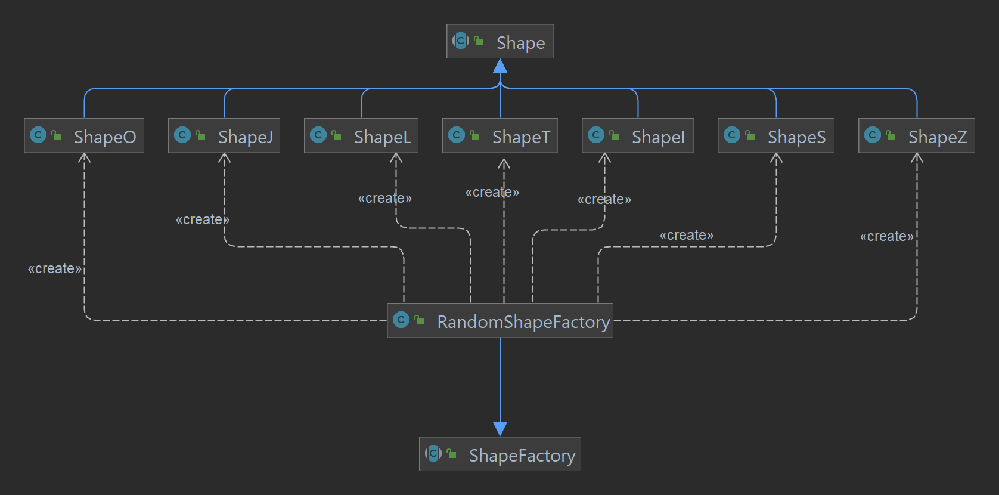

### DESIGN

#### PROBLEM OF ORGANIZATION OF CODE

**Problem in Context**

It is hard to first decide how are we going to organize our code, but it is very important to decide how are we going to do it early on
because that allows us to start building our project in a structured manner, and helps us avoid organizational errors in the future of the project.
That is, if we don't take the initiative to compartmentalize our code into its functional logic, later on it's really hard
to add new features, or work with previous features, because everything is in a "tangled thread" of random classes and methods,
making it hard to look for we want to find.

**The Pattern**

To solve this problem, we decided to use the **MVC (Model-Viewer-Controller)** architectural pattern. This architectural pattern
allows us to divide our project into three integral parts: the model, the viewer, and the controller. The model contains the data
of the objects, the viewer displays the model data, and sends user actions to the controller, and finally the controller provides model data
to the view, interprets user actions. By organizing the code this way, we're sure that when we need to change with the display of
data of a certain model, we just need to access the viewer, and when we need to execute the inputs done by the user and change the
model data, we use the controller.

**Implementation**

The UML presented at the beginning of the report shows how we organized our code by that model.

However, to see a simpler way of the implementation of the MVC Architectural Pattern, you can check
the following diagram, or the packages that contain the Model, Controller and Viewer classes.

- [Model](../src/main/java/tetrisRunner/model)
- [Viewer](../src/main/java/tetrisRunner/viewer)
- [Controller](../src/main/java/tetrisRunner/controller)

**Consequences**

The use of the MVC Architectural Pattern in the current design allows the following benefits:

- Organize our code logically by its 3 main components: behaviour control, data and media visualization.
- We achieve a more Object-Oriented Programming, by dividing the classes on what they do, rather than how they do it
- There are now more classes and instances to manage, but still in a reasonable number
- In the long term, this model allows us to make the maintenance of the project easier

Therefore, we considered this to be the best pattern to organize our code.

------

#### RANDOMIZE SHAPES FALLING

**Problem in Context**

For the game to work correctly, we need to set a random Shape to fall toward the ground,
and after it reached the ground level (plus some extra time to maneuver the piece), we want
another random shape to be set in the initial position (high above the ground), and continue
this game throughout the game loop. However, we don't want to explicitly call the constructor
of a certain shape (we want to keep the abstraction). To do that, we want to find a way to generate
the shapes in a structured and efficient way.

**The Pattern**

To accomplish this, we decided to use the **Factory Method** pattern. We created an abstract class `ShapeFactory`, which
is extended by the class `RandomShapeFactory`. This factory will then produce the different
shapes that extend the class `Shape`.

**Implementation**

As you can see in the following UML, this is how we implemented the pattern described above:

You can find the classes used in the Design Pattern in the following package:

- [Shapes](../src/main/java/tetrisRunner/model/game/shapes)

**Consequences**

The use of the Factory Method Pattern in the current design allows the following benefits:

- Factory methods eliminate the need to bind application-specific classes into our code
- Allows the `ShapeFactory` to be extended in the future, to create other factories (which can create Shapes in other way
rather than randomly)
- Avoids code smells, since we just need to call the factory, and run the command which creates the coins

Therefore, we considered this to be the best pattern to create new shapes easily, and the best pattern to solve
the problem described above.

---

#### RANDOMIZE COINS IN CLASSIC MODE

**Problem in Context**

As it was explained in the game features, the Classic Mode has coins, which gives points to the player(s) if caught.
They can spawn randomly on the map (only not under static elements, such as blocks and Walls, or on top of other coins).
We want to generate those coins randomly (as said before), but we don't want to explicitly call the `Coin` constructor.
So, we need to find a solution that allows us to delegate de construction to other components.

**The Pattern**

To accomplish this, we decided to use the **Factory Method** pattern. We created an abstract class `ElementFactory`, which
is extended by the class `CoinFactory`. This factory will then produce the coins in random positions.

**Implementation**

As you can see in the following UML, this is how we implemented the pattern described above:

You can find the classes used in the Design Pattern in the following files:

- [ElementFactory](../src/main/java/tetrisRunner/model/game/elements/ElementFactory.java)
- [CoinFactory](../src/main/java/tetrisRunner/model/game/elements/CoinFactory.java)
- [Element](../src/main/java/tetrisRunner/model/game/elements/Element.java)
- [Coin](../src/main/java/tetrisRunner/model/game/elements/Coin.java)

**Consequences**

The use of the Factory Method Pattern in the current design allows the following benefits:

- Factory methods eliminate the need to bind application-specific classes into our code
- Allows the `ElementFactory` to be extended in the future, to create other factories (which can create different elements,
or allow other ways to create coins)
- Avoids code smells, since we just need to call the factory, and run the command which creates the coins

Therefore, we considered this to be the best pattern to create coins randomly, and the best pattern to solve
the problem described above.

---

#### TRAVERSAL THROUGH THE GAME STATES

**Problem in Context**

We need to know how are we going to achieve the different states of the game (the different submenus, the game with its different
 modes, ...). What often happens (and is a bad programming practice in OOP) is the usage of if-else clauses to achieve 
different stages of the game. However, that just makes the code harder to decipher in the future, and harder to modify 
to find the change we need to do (since we would have to search all the if-else clauses). So, we need a way to traverse
through these different states, while maintaining the code organize, readable and implemented in a logical way.

**The Pattern**

To accomplish this, we decided to use the **State** pattern. This design pattern is specially helpful when
an object behavior depends on its state, and it must change that state in run-time. Since we have a lot of states of the
program that need to be achieved (Menu States, Game States, ...), then this pattern is ideal to us.

**Implementation**

The following UML shows how the different states were created: we implemented an abstract class
State<T>, that takes as arguments the different models of the states we wish to achieve. Then, in the different controllers,
the different states could be accessed one through another: 
> Example: if the A Controller calls the B State, then from
the A State we could achieve the B State

You can find the classes used in the Design Pattern in the following package:

- [States](../src/main/java/tetrisRunner/states)

**Consequences**

The use of the State Pattern in the current design allows the following benefits:

- Localizes and partitions behavior for different states.
- Makes state transitions explicit.
- We don’t need to have a long set of conditional if or switch statements associated with the various states; instead, polimorphism is used to activate the right behavior.
- There are now more classes and instances to manage, but still in a reasonable number.

Therefore, we considered this to be the best pattern to achieve different sections of our game, keeping a good OOP
practices, and making it easier to implement the game traversal logic like one of a state diagram.