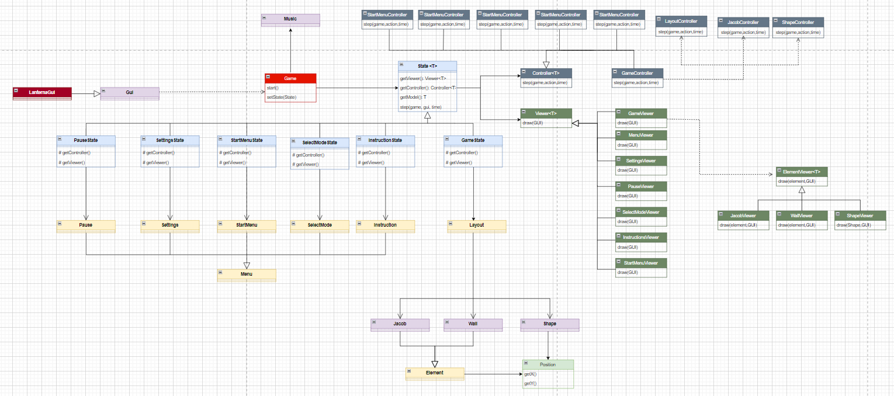

# LDTS_l05gr06 - TETRIS RUNNER

### Game Description

In this new exciting version of a game we all are familiar with - tetris - there's a vast sea of fun ways to play it.
The game is basically the tetris everyone knows, but there's a little man - Jacob - down there, where the shapes fall, trying to avoid them.

This makes it so there's a lot of options for the users - let's call the user controlling the shapes player1 and the one controlling
Jacob player2- to choose:

- **"Classic"** - While player1 is playing normal tetris, player2 is collecting floating coins while avoiding the falling shapes. They are
both trying to get as many points are possible, and that can be accomplished by clearing lines and catching coins;
- **Climbing** - The speedrun variant. Player1 needs to get player2 up top as fast as possible;
- **1v1** - Player1 is purposefully trying to make player2 loose. He has 1 minute to do it.

Note that the game doesn't need to be multiplayer, with the right coordination it is possible for someone to control both the shapes
and Jacob. The only game mode exclusively multiplayer is 1v1.

### Screenshots / Gifs

The following gif illustrates a little of the concept we
want to implement in this game (that is runnable in the code).

### State Diagram

This Diagram shows how we want to implement the state-logic behind the game,
and how the user can access one state through another.

### UML Diagram

The following UML Diagram showcases the most important classes in our game,
and how they interact with each other

### IMPLEMENTED FEATURES

**Menus**: Working menu with multiple options, such as 'Game Mode', to select the intended variant of the game, 'Instructions', to read the instructions of each
mode and, finally, 'Leaderboard', to track the high scores of each game mode. We also implemented the tetris theme song running on the background,
therefore there's an additional option 'Settings' in which you can mute and change the music's volume.

When in game, when pressing 'ESC', there's an additional menu - the pause menu, that, as it suggests, pauses the game and gives you the options
to close the game, return to main menu, change settings or return to the paused game.

When a game ends, it's always going to a GameOver menu. In 1v1, this menu will say who won the round. In the other two game modes,
there's an additional HighScore menu (if you get a good enough score) for the user to write its name (name is a string such as "XXX"). The Leaderboard will then be updated.

**Jacob**:

- **Jumping** - The game character will jump when the arrow-up key is pressed.
- **Moving** - The player will move, sideways, when the user presses arrow-left or arrow-right.

**Shapes**:

- **Moving the shape** - The shape will move, sideways, when the user presses 'A' or 'D' (left or right, respectively).
- **Rotating the shape** - The shape will rotate, when the user presses 'W' or 'S' (clockwise or anti-clockwise, respectively).
- **Instantly dropping the shape** - The shape will drop to the ground, when the user presses the space bar (not in 1v1 mode).
- **Resigning** - While in 1v1, if player1 sees that it's impossible for them to win (Jacob is protected and there's no way for the 
shapes to kill him), they can resign if they press 'R', giving a point to Jacob.

**Score**: The score is kept track differently for each game mode.

- **Classic** - The score (in the bottom left corner) starts at zero and goes up indefinitely. For the score to go up, there are
three different ways:
   - **Clearing lines** - Clearing lines will give the player(s) 100, 300, 500 or 800 points, if they clear
  1, 2, 3 or 4 lines, respectively. (Be careful! The game will get faster as each line is cleared.)
   - **Getting Coins** - Each Coin that Jacob grabs gives the player(s) 125 points.
   - **Instantly Dropping** - Like in original tetris, pressing the space bar will give the player(s) points equal
  to the double of the distance left to the ground.

- **Climbing** - The score (in the bottom left corner) is a timer starting at 0. The score is better the lower the final time is.

- **1v1** - The score is kept in the bottom right corner. For example if the layout displays "3-1" shapes are beating Jacob by 3 to 1.
There is also a countdown timer running in the bottom left corner, starting at 1 minute.

### DESIGN

#### PROBLEM OF ORGANIZATION OF CODE

**Problem in Context**

It is hard to first decide what main method to organize our code, but it is very important to decide how are we going to do it early on 
because that allows us to start building our project in a structured, and avoid organizational errors in the future of the project.

**The Pattern**

To accomplish this, we decided to use the **MVC (Model-Viewer-Controller)** architectural pattern. This architectural pattern
is commonly used for developing user interfaces that divides an application into three parts. The model represents the data,
the view displays the model data, and sends user actions to the controller, and finally the controller provides model data
to the view, and interprets user actions.

**Implementation**

The UML presented at the beginning of the report shows how we organized our code by that model.

**Consequences**

The use of the MVC Architectural Pattern in the current design allows the following benefits:

- Organize our code logically by its 3 main components: behaviour control, data and media visualization.
- We achieve a more Object-Oriented Programming, by dividing the classes on what they do, rather than how they do it
- There are now more classes and instances to manage, but still in a reasonable number.

Therefore, we considered this to be the best pattern to organize our code.

------

#### IMPLEMENTATION OF SEVERAL MENUS

**Problem in Context**

We need to implement a lot of menus in our game. That is because, as we said above, want the user to select different
options before he can start the game. It can be the Game Mode, or he maybe doesn't want to hear the music playing, so
he wishes to mute it, or hen doesn't want to play the game at all, and he wishes to quit. Therefore, it is necessary that
we provide different Menus, according to the user wishes.

**The Pattern**

To accomplish this, we decided to use the **Factory** pattern. We created an abstract class Menu, which is then extended
by the other sub-classes (other sub-menus).

**Implementation**

As it can be seen in the UML, there is a Menu that is being extended by other sub-menus.

**Consequences**

The use of the Factory Method Pattern in the current design allows the following benefits:

- Factory methods eliminate the need to bind application-specific classes into our code

Therefore, we considered this to be the best pattern to implement new sub-menus easily, since they share a lot of features
with each other.

------

#### PROBLEM OF TRAVERSAL THROUGHOUT THE CODE

**Problem in Context**

We need to know how are we going to achieve the different states of the game. What usually happens (and is a bad programming 
practice in OOP) is the usage of if-else clauses to achieve different stages of the game. However, that just makes
the code harder to decipher in the future, and harder to modify (because we would have to search all the if-else clauses)
to find the change we need to do.

**The Pattern**

To accomplish this, we decided to use the **State** pattern. This design pattern is specially helpful when
an object behavior depends on its state, and it must change that state in run-time. Since we have a lot of states of the
program that need to be achieved (Menu States, Game States, ...), then this pattern is ideal to us.

**Implementation**

The UML presented at the beginning of the report shows how we organized our code by that model (creation of an abstract class
State<T>, that takes as arguments the different states we wish to achieve).

**Consequences**

The use of the State Pattern in the current design allows the following benefits:

- Localizes and partitions behavior for different states.
- Makes state transitions explicit.
- We don’t need to have a long set of conditional if or switch statements associated with the various states; instead, polymorphism is used to activate the right behavior.
- There are now more classes and instances to manage, but still in a reasonable number.

Therefore, we considered this to be the best pattern to achieve different sections of our game, keeping a good OOP
practices, and making it easier to implement the state diagram shown above.

-----

#### KNOWN CODE SMELLS AND REFACTORING SUGGESTIONS

There are some code smells in our code, and we are totally aware of them:

- Switch Statements:
We also have some over complex if/switch statements over the code, with the function step in LayoutController being the
most complicated one. To fix this, the easiest way would be to reorganize the code by breaking the function into smaller,
easier to read functions. We decided not to change it, since we can still read the code and creating more layoutController functions
would be a bit of an overkill.

- Long Class:
Regarding the long class code smell, we would say that the instruction's classes are the ones that would maybe be too long. We
could fix that by extracting methods or creating new states for each specific instruction, but we decided to go with a more complex
Instructions State so there wouldn't be too much more states, each needing a viewer and a controller.

- Duplicated Code:
We have some duplicated code in, for example, the ShapeController Class, regarding the rotates in different directions. We decided to keep
it that way, considering that each rotate is supposed to act differently. Therefore, if we want to change one we don't have to change the other one.

- Lazy Class: 
Lazy classes are present, for example, in the element models. Most of those only have a constructor, but these make the code more organized
and more respecting of the MVC architecture.

- Temporary Field:
There are some instances in which we initiate new variables only for them to be worked around within a function which are considered
code smells of the temporary field kind. We decided to keep it that way so those functions would be easier to read (for example
initiating a new object equal to a getter, so we wouldn't need to use getModel().getSomething()) each time we needed to address the object.

- Refused Bequest:
Some subclasses, specially the different shapes classes, have methods that they don't implement and/or implement but don't do anything. We decided
to keep it that way, so the code would be more organized and easier to read the project as a whole.

### TESTING

### SELF-EVALUATION

- Francisco Campos: 33.3%
- João Figueiredo: 33.3%
- João Longras: 33.3%