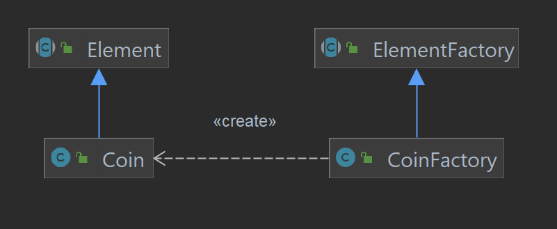

LDTS_l05gr06 - TETRIS RUNNER

### Game Description

In this new exciting version of a game we all are familiar with - tetris - there's a vast sea of fun ways to play it.
The game is basically the tetris everyone knows, but there's a little man - Jacob - down there, where the shapes fall, trying to avoid them.

This makes it so there's a lot of options for the users - let's call the user controlling the shapes player1 and the one controlling
Jacob player2- to choose:

- **"Classic"** - While player1 is playing normal tetris, player2 is collecting floating coins while avoiding the falling shapes. They are
  both trying to get as many points are possible, and that can be accomplished by clearing lines and catching coins;
- **Climbing** - The speedrun variant. Player1 needs to get player2 up top as fast as possible;
- **1v1** - Player1 is purposefully trying to make player2 loose. He has 1 minute to do it.

Note that the game doesn't need to be multiplayer, with the right coordination it is possible for someone to control both the shapes
and Jacob. The only game mode exclusively multiplayer is 1v1.

---

### IMPLEMENTATION - UML

The following UML shows how all classes interact with each other:

---

### FEATURES

**Menus**: Working menu with multiple options, such as 'Game Mode', to select the intended variant of the game, 'Instructions', to read the instructions of each
mode and, finally, 'Leaderboard', to track the high scores of each game mode. We also implemented the tetris theme song running on the background,
therefore there's an additional option 'Settings' in which you can mute and change the music's volume.

When in game, when pressing 'ESC', there's an additional menu - the pause menu, that, as it suggests, pauses the game and gives you the options
to close the game, return to main menu, change settings or return to the paused game.

When a game ends, it's always going to a GameOver menu. In 1v1, this menu will say who won the round. In the other two game modes,
there's an additional HighScore menu (if you get a good enough score) for the user to write its name (name is a string such as "XXX"). The Leaderboard will then be updated.

**Jacob**:

- **Jumping** - The game character will jump when the arrow-up key is pressed.
- **Moving** - The player will move, sideways, when the user presses arrow-left or arrow-right.

**Shapes**:

- **Moving the shape** - The shape will move, sideways, when the user presses 'A' or 'D' (left or right, respectively).
- **Rotating the shape** - The shape will rotate, when the user presses 'W' or 'S' (clockwise or anti-clockwise, respectively).
- **Instantly dropping the shape** - The shape will drop to the ground, when the user presses the space bar (not in 1v1 mode).
- **Resigning** - While in 1v1, if player1 sees that it's impossible for them to win (Jacob is protected and there's no way for the
  shapes to kill him), they can resign if they press 'R', giving a point to Jacob.

**Score**: The score is kept track differently for each game mode.

- **Classic** - The score (in the bottom left corner) starts at zero and goes up indefinitely. For the score to go up, there are
  three different ways:
    - **Clearing lines** - Clearing lines will give the player(s) 100, 300, 500 or 800 points, if they clear
      1, 2, 3 or 4 lines, respectively. (Be careful! The game will get faster as each line is cleared.)
    - **Getting Coins** - Each Coin that Jacob grabs gives the player(s) 125 points.
    - **Instantly Dropping** - Like in original tetris, pressing the space bar will give the player(s) points equal
      to the double of the distance left to the ground.

- **Climbing** - The score (in the bottom left corner) is a timer starting at 0. The score is better the lower the final time is.

- **1v1** - The score is kept in the bottom right corner. For example if the layout displays "3-1" shapes are beating Jacob by 3 to 1.
  There is also a countdown timer running in the bottom left corner, starting at 1 minute.

---

### DESIGN

#### PROBLEM OF ORGANIZATION OF CODE

**Problem in Context**

It is hard to first decide how are we going to organize our code, but it is very important to decide how are we going to do it early on
because that allows us to start building our project in a structured manner, and helps us avoid organizational errors in the future of the project.
That is, if we don't take the initiative to compartmentalize our code into its functional logic, later on it's really hard
to add new features, or work with previous features, because everything is in a "tangled thread" of random classes and methods,
making it hard to look for we want to find.

**The Pattern**

To solve this problem, we decided to use the **MVC (Model-Viewer-Controller)** architectural pattern. This architectural pattern
allows us to divide our project into three integral parts: the model, the viewer, and the controller. The model contains the data
of the objects, the viewer displays the model data, and sends user actions to the controller, and finally the controller provides model data
to the view, interprets user actions. By organizing the code this way, we're sure that when we need to change with the display of
data of a certain model, we just need to access the viewer, and when we need to execute the inputs done by the user and change the
model data, we use the controller.

**Implementation**

The UML presented at the beginning of the report shows how we organized our code by that model.

However, to see a simpler way of the implementation of the MVC Architectural Pattern, you can check
the following diagram, or the packages that contain the Model, Controller and Viewer classes.

- [Model](../src/main/java/tetrisRunner/model)
- [Viewer](../src/main/java/tetrisRunner/viewer)
- [Controller](../src/main/java/tetrisRunner/controller)

**Consequences**

The use of the MVC Architectural Pattern in the current design allows the following benefits:

- Organize our code logically by its 3 main components: behaviour control, data and media visualization.
- We achieve a more Object-Oriented Programming, by dividing the classes on what they do, rather than how they do it
- There are now more classes and instances to manage, but still in a reasonable number
- In the long term, this model allows us to make the maintenance of the project easier

Therefore, we considered this to be the best pattern to organize our code.

---

#### RANDOMIZE SHAPES FALLING

**Problem in Context**

For the game to work correctly, we need to set a random Shape to fall toward the ground,
and after it reached the ground level (plus some extra time to maneuver the piece), we want
another random shape to be set in the initial position (high above the ground), and continue
this game throughout the game loop. However, we don't want to explicitly call the constructor
of a certain shape (we want to keep the abstraction). To do that, we want to find a way to generate
the shapes in a structured and efficient way.

**The Pattern**

To accomplish this, we decided to use the **Factory Method** pattern. We created an abstract class `ShapeFactory`, which
is extended by the class `RandomShapeFactory`. This factory will then produce the different
shapes that extend the class `Shape`.

**Implementation**

As you can see in the following UML, this is how we implemented the pattern described above:

You can find the classes used in the Design Pattern in the following package:

- [Shapes](../src/main/java/tetrisRunner/model/game/shapes)

**Consequences**

The use of the Factory Method Pattern in the current design allows the following benefits:

- Factory methods eliminate the need to bind application-specific classes into our code
- Allows the `ShapeFactory` to be extended in the future, to create other factories (which can create Shapes in other way
  rather than randomly)
- Avoids code smells, since we just need to call the factory, and run the command which creates the coins

Therefore, we considered this to be the best pattern to create new shapes easily, and the best pattern to solve
the problem described above.

---

#### RANDOMIZE COINS IN CLASSIC MODE

**Problem in Context**

As it was explained in the game features, the Classic Mode has coins, which gives points to the player(s) if caught.
They can spawn randomly on the map (only not under static elements, such as blocks and Walls, or on top of other coins).
We want to generate those coins randomly (as said before), but we don't want to explicitly call the `Coin` constructor.
So, we need to find a solution that allows us to delegate de construction to other components.

**The Pattern**

To accomplish this, we decided to use the **Factory Method** pattern. We created an abstract class `ElementFactory`, which
is extended by the class `CoinFactory`. This factory will then produce the coins in random positions.

**Implementation**

As you can see in the following UML, this is how we implemented the pattern described above:

You can find the classes used in the Design Pattern in the following files:

- [ElementFactory](../src/main/java/tetrisRunner/model/game/elements/ElementFactory.java)
- [CoinFactory](../src/main/java/tetrisRunner/model/game/elements/CoinFactory.java)
- [Element](../src/main/java/tetrisRunner/model/game/elements/Element.java)
- [Coin](../src/main/java/tetrisRunner/model/game/elements/Coin.java)

**Consequences**

The use of the Factory Method Pattern in the current design allows the following benefits:

- Factory methods eliminate the need to bind application-specific classes into our code
- Allows the `ElementFactory` to be extended in the future, to create other factories (which can create different elements,
  or allow other ways to create coins)
- Avoids code smells, since we just need to call the factory, and run the command which creates the coins

Therefore, we considered this to be the best pattern to create coins randomly, and the best pattern to solve
the problem described above.

---

#### TRAVERSAL THROUGH THE GAME STATES

**Problem in Context**

We need to know how are we going to achieve the different states of the game (the different submenus, the game with its different
modes, ...). What often happens (and is a bad programming practice in OOP) is the usage of if-else clauses to achieve
different stages of the game. However, that just makes the code harder to decipher in the future, and harder to modify
to find the change we need to do (since we would have to search all the if-else clauses). So, we need a way to traverse
through these different states, while maintaining the code organize, readable and implemented in a logical way.

**The Pattern**

To accomplish this, we decided to use the **State** pattern. This design pattern is specially helpful when
an object behavior depends on its state, and it must change that state in run-time. Since we have a lot of states of the
program that need to be achieved (Menu States, Game States, ...), then this pattern is ideal to us.

**Implementation**

The following UML shows how the different states were created: we implemented an abstract class
State<T>, that takes as arguments the different models of the states we wish to achieve. Then, in the different state controllers,
these states can be accessed one through another, being the new State used in the Game.

You can find the classes used in the Design Pattern in the following file and package:

- [Game](../src/main/java/tetrisRunner/Game.java)
- [States](../src/main/java/tetrisRunner/states)

**Consequences**

The use of the State Pattern in the current design allows the following benefits:

- Localizes and partitions behavior for different states.
- Makes state transitions explicit.
- We don’t need to have a long set of conditional if or switch statements associated with the various states; instead, polimorphism is used to activate the right behavior.
- There are now more classes and instances to manage, but still in a reasonable number.

Therefore, we considered this to be the best pattern to achieve different sections of our game, keeping a good OOP
practices, and making it easier to implement the game traversal logic like one of a state diagram.

---

#### DECIDING WHAT GAME IS THE USER PLAYING

**Problem in Context**

The game mode in this game is, essentially, the different ways the player(s) can enjoy the same game mechanics.
That is, we want to have the same game features described in the beginning of the report, but have different win, lose and
leaderboard update conditions, according to each game mode.

**The Pattern**

To solve this problem, we decided to use the **Strategy** pattern. This design pattern is very useful when
the desired new classes only differ in their behavior. Therefore, instead of creating a new class with repeated
information (or one that needs to call other classes, and therefore, increase dependencies), we instead let the client
decide, for each object of the class, which behavior he would like to see implemented.
For these reasons, we decided that this pattern was a better option, ratter than pursue the naive implementation of
creating new states for each different mode.

**Implementation**

The following UML shows how we implemented the Strategy Pattern: the `Layout` (built when the game starts), has as a parameter
a `GameBehavior`, which can be set by the client (by choosing in the SelectModeMenu which Game Mode he wants) for one of
the specific implementations: `ClassicBehavior`, `ClimbingBehavior` and `PvPBehavior`

You can find the classes used in the Design Pattern in the following file and package:

- [Layout](../src/main/java/tetrisRunner/model/game/layout/Layout.java)
- [GameBehavior](../src/main/java/tetrisRunner/model/game/gamebehavior)

**Consequences**

The use of the Strategy Pattern in the current design allows the following benefits:

- Eliminates conditional statements
- Avoids the duplicate code smell
- One class can express multiple behaviors, while maintaining some core methods general to all behaviors

Therefore, we think that the Strategy pattern is the best pattern to solve the problem in question, since we can maintain
all the core methods common to all behaviors, and insert key methods specific to each behavior, all in the same class.

-----

### KNOWN CODE SMELLS AND REFACTORING SUGGESTIONS

There are some code smells in our code, and we are totally aware of them:

#### Switch Statements:
  We also have some over complex if/switch statements over the code, with the function step in LayoutController being the
  most complicated one. To fix this, the easiest way would be to reorganize the code by breaking the function into smaller,
  easier to read functions. We decided not to change it, since we can still read the code and creating more layoutController functions
  would be a bit of an overkill.

#### Long Class:
  Regarding the long class code smell, we would say that the instruction's classes are the ones that would maybe be too long. We
  could fix that by extracting methods or creating new states for each specific instruction, but we decided to go with a more complex
  Instructions State so there wouldn't be too much more states, each needing a viewer and a controller.

#### Duplicated Code:
  We have some duplicated code in, for example, the ShapeController Class, regarding the rotates in different directions. We decided to keep
  it that way, considering that each rotate is supposed to act differently. Therefore, if we want to change one we don't have to change the other one.

#### Lazy Class:
  Lazy classes are present, for example, in the element models. Most of those only have a constructor, but these make the code more organized
  and more respecting of the MVC architecture.

#### Temporary Field:
  There are some instances in which we initiate new variables only for them to be worked around within a function which are considered
  code smells of the temporary field kind. We decided to keep it that way so those functions would be easier to read (for example
  initiating a new object equal to a getter, so we wouldn't need to use getModel().getSomething()) each time we needed to address the object.

#### Refused Bequest:

Some subclasses, specially the different shapes classes, have methods that they don't implement and/or implement but don't do anything. We decided
to keep it that way, so the code would be more organized and the project easier to read as a whole.

### TESTING

#### Test Code Coverage

Check full Test Coverage Report [here](reports/pitest/202212240256/index.html)

#### Mutation Test

Check full Pitest Report [here](reports/tests/test/index.html)

### SELF-EVALUATION

- Francisco Campos: 33.3%
- João Figueiredo: 33.3%
- João Longras: 33.3%